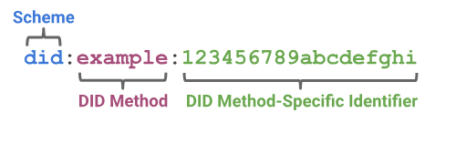
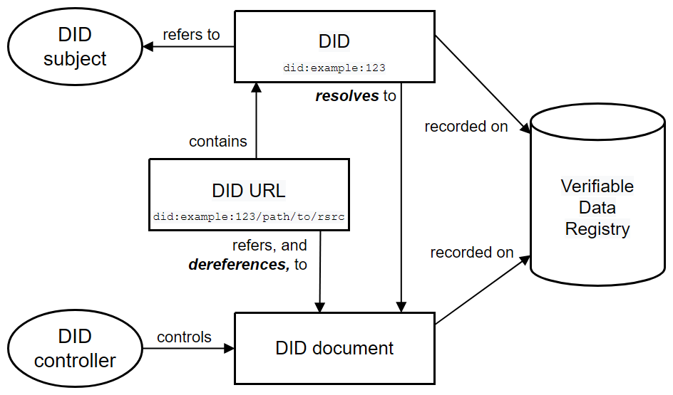

#### Environment

go 1.18

go mod tidy

go run main.go

### DID

#### A DID is a simple text string consisting of three parts: 
1) the did URI scheme identifier, 
2) the identifier for the DID method
3) the DID method-specific identifier.


The example DID above resolves to a DID document. A DID document contains information associated with the DID, such as ways to cryptographically authenticate a DID controller.

####  EXAMPLE 1: A simple DID document
```json
{
"@context": [
"https://www.w3.org/ns/did/v1",
"https://w3id.org/security/suites/ed25519-2020/v1"
],
"id": "did:example:123456789abcdefghi",
"authentication": [{

    "id": "did:example:123456789abcdefghi#keys-1",
    "type": "Ed25519VerificationKey2020",
    "controller": "did:example:123456789abcdefghi",
    "publicKeyMultibase": "zH3C2AVvLMv6gmMNam3uVAjZpfkcJCwDwnZn6z3wXmqPV"
}]
}
```
#### DID Architecture Overview


#### DID controllers:

The controller of a DID is the entity (person, organization, or autonomous software) that has the capability—as defined by a DID method—to make changes to a DID document. 

#### DID documents:

DID documents contain information associated with a DID. They typically express verification methods, such as cryptographic public keys, and services relevant to interactions with the DID subject. 